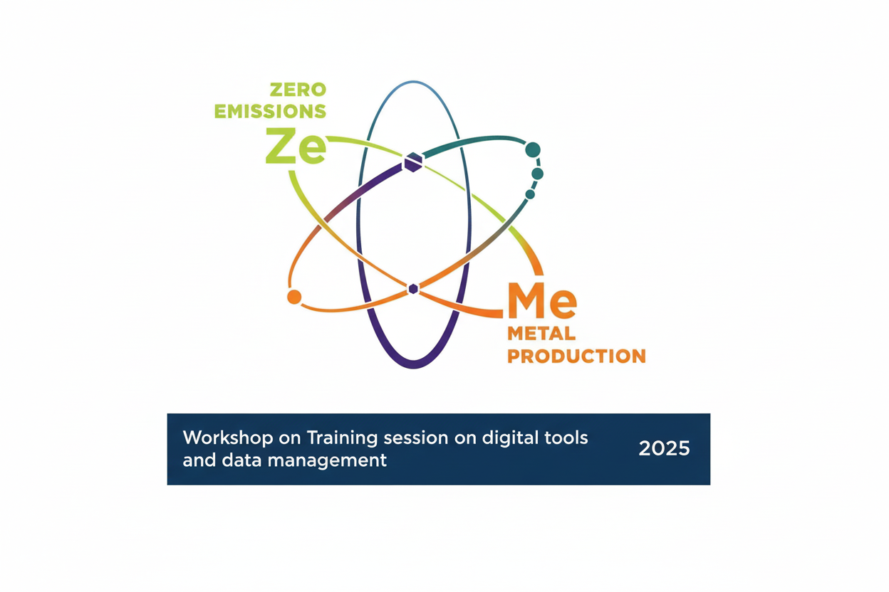

# FME ZeMe - Workshop on Training session on digital tools and data management - 2025

  

Here you can find the python files and input data for the Workshop

## Quick Start (Google Colab)

To open the workshop part on **Plotting and Statistics in Python** in Google Colab, click here: 

or paste this URL in your browser:
https://colab.research.google.com/github/TomasManik/FME-ZeMe-DigiWorkshop2025/blob/main/Plotting_and_Statistics_in_Python.ipynb
